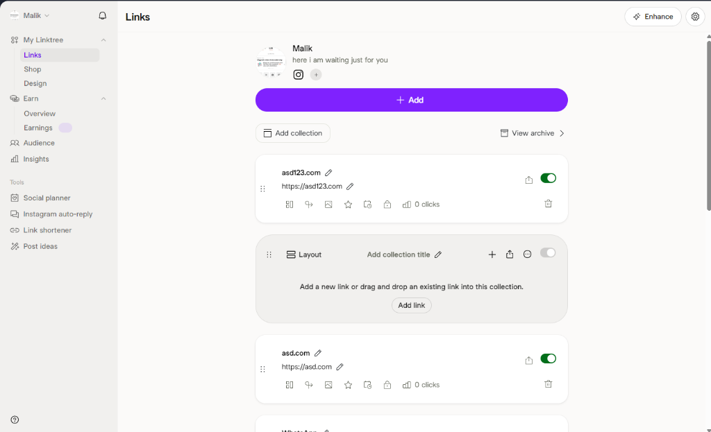

<style>
  body { font-family: 'Inter', sans-serif; max-width: 800px; margin: 0 auto; padding: 40px 20px; }
  h1 { color: #1a1a2e; border-bottom: 3px solid #7c3aed; padding-bottom: 10px; }
  h2 { color: #7c3aed; margin-top: 30px; }
  h3 { color: #374151; }
  .header { display: flex; align-items: center; gap: 20px; margin-bottom: 30px; }
  .logo { width: 60px; height: 60px; }
  .company { font-size: 14px; color: #6b7280; }
  table { width: 100%; border-collapse: collapse; margin: 20px 0; }
  th, td { border: 1px solid #e5e7eb; padding: 12px; text-align: left; }
  th { background: #f3f4f6; }
  .highlight { background: #fef3c7; padding: 15px; border-radius: 8px; margin: 20px 0; }
  .checkbox { list-style: none; padding-left: 0; }
  .checkbox li { padding: 8px 0; }
  .checkbox li::before { content: "☐ "; }
  img { max-width: 100%; border-radius: 8px; margin: 20px 0; box-shadow: 0 4px 6px rgba(0,0,0,0.1); }
</style>

<div class="header">
  
  <div>
    <h1 style="border: none; padding: 0; margin: 0;">Fullstack Engineer Assessment</h1>
    <p class="company">PT Entropi Global Martech</p>
  </div>
</div>

---

## Overview

Build a **"Link in Bio" application** (similar to Linktree) with admin dashboard and public profile page.

**Deadline: 2 Days**

---

## Reference Design

Use this Linktree admin interface as your visual reference:



---

## What to Build

### 1. Public Profile Page (Mobile-First)
A shareable page showing:
- User avatar & bio
- List of clickable links
- Clean, modern design

### 2. Admin Dashboard
A simple dashboard to:
- Add/Edit/Delete links
- Toggle links on/off
- Reorder links (drag & drop optional)
- Edit profile (name, bio, avatar URL)

### 3. Backend API
Simple REST API for:
- CRUD operations for links
- Profile management
- Basic authentication (login/register)

---

## Tech Stack

| Layer | Technology |
|-------|------------|
| Frontend | Next.js 14+ (App Router) |
| Styling | Tailwind CSS or custom CSS |
| Backend | Next.js API Routes |
| Database | PostgreSQL + Prisma (or SQLite for simplicity) |
| Auth | NextAuth.js or simple JWT |

---

## Requirements

### Must Have (Core)
- [ ] User can register and login
- [ ] User can add links (title + URL)
- [ ] User can edit and delete links
- [ ] User can toggle links active/inactive
- [ ] Public profile page displays user's links
- [ ] Mobile-responsive design

### Nice to Have (Bonus)
- [ ] Drag & drop reorder
- [ ] Click tracking/analytics
- [ ] Dark mode
- [ ] Custom theme colors

---

## Database Schema (Suggested)

```prisma
model User {
  id        String   @id @default(uuid())
  email     String   @unique
  password  String
  name      String
  bio       String?
  avatar    String?
  links     Link[]
  createdAt DateTime @default(now())
}

model Link {
  id        String   @id @default(uuid())
  title     String
  url       String
  active    Boolean  @default(true)
  order     Int      @default(0)
  userId    String
  user      User     @relation(fields: [userId], references: [id])
  createdAt DateTime @default(now())
}
```

---

## Submission

### Required
1. **GitHub Repository** (public)
2. **README.md** with:
   - Setup instructions
   - What you implemented
   - Time breakdown

### Bonus
- Live demo (Vercel/Railway)

---

## Evaluation Criteria

| Criteria | Weight |
|----------|--------|
| Functionality (everything works) | 40% |
| Code Quality (clean, organized) | 25% |
| UI/UX (looks good, easy to use) | 25% |
| Documentation | 10% |

---

## Tips for Success

<div class="highlight">
💡 <strong>Focus on core features first!</strong> A working MVP with clean code beats incomplete fancy features.
</div>

**Suggested 2-day breakdown:**
- **Day 1:** Database setup, Auth, API routes, basic CRUD
- **Day 2:** UI polish, public profile page, testing, deploy

---

## Contact

For questions, contact our HR team:
📧 **baby@entropimartech.com**

---

*Good luck! We're excited to see what you build.* 🚀
